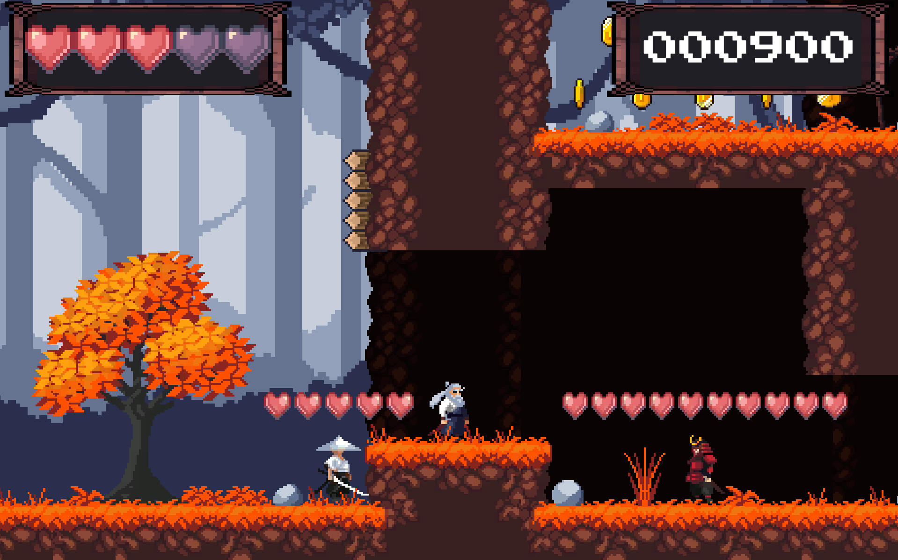
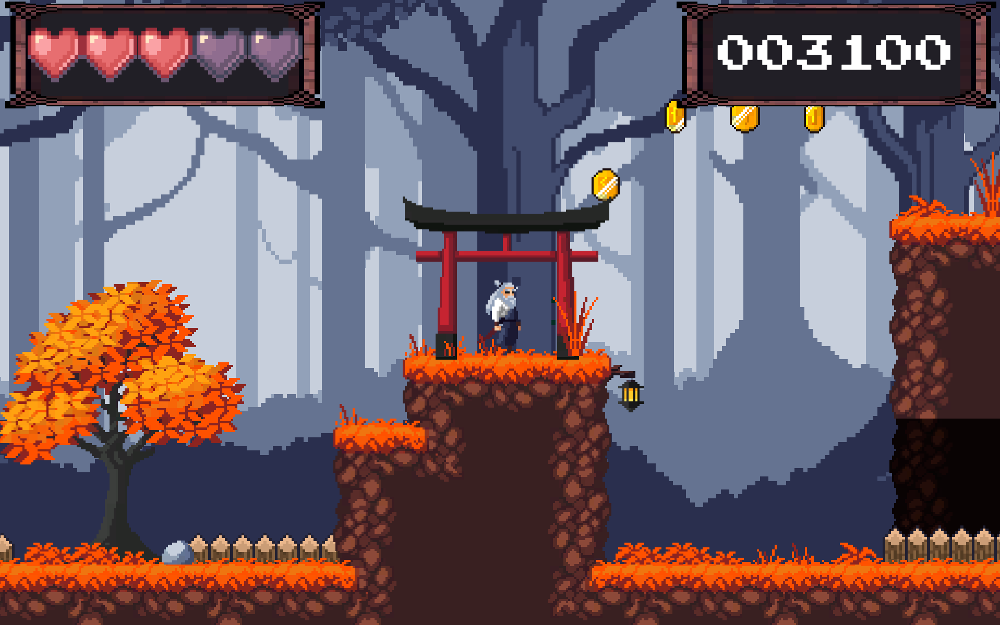
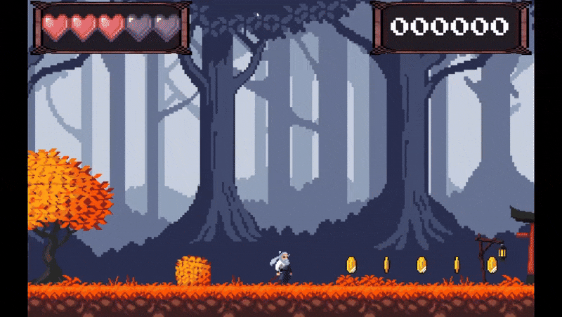

# 🎮 The Last Oath  
> A satisfying pixel-art platformer infused with fast-paced combat.  
> Embark on a journey of revenge and avenge your fallen samurai brother!

[](#license)
[](#requirements)

## 📖 Table of Contents  
- [About](#about)  
- [Features](#features)  
- [Demo / Screenshots](#demo--screenshots)  
- [Getting Started](#getting-started)  
  - [Requirements](#requirements)  
  - [Installation](#installation)  
- [Usage](#usage)  
  - [Controls](#controls)  
- [Architecture & Tech Stack](#architecture--tech-stack)  
- [Contributing](#contributing)  
- [License](#license)  
- [Contact](#contact)

---

## 🧠 About  
**The Last Oath** is a 2D **pixel-art platformer** created in **Unity** using **C#**.  
You control a samurai seeking revenge across several handcrafted levels filled with enemies, traps, and collectibles.  

- Jump and dash across platforms while collecting coins and defeating enemies.  
- Reach the end of each stage with the highest score possible.  
- Distinct soundtracks, obstacles, and level designs give every map its own atmosphere.  
- This project was built as a **school final project (Atestat)**, and its in-game text is available only in **Romanian**.

---

## ✨ Features  
- 🎯 Challenging platforming mixed with fast melee combat.  
- 🕹️ Keyboard-based controls (mouse used only for menu navigation).  
- 📦 Multiple levels with increasing difficulty and distinct designs.  
- 🔊 Each level features its own soundtrack and sound effects for actions and ambience.  
- 🧱 Clean modular Unity structure — easily extendable for new levels or mechanics.  

---

## 🖼️ Demo / Screenshots  
| Screenshot 1 | Screenshot 2 |
|--------------|--------------|
|  |  |

<p align="center">
  
</p>

---

## ⚙️ Getting Started  

### Requirements  
- **Unity 2022.3 LTS** or later  
- **Windows 10+** (tested build)  
- .NET Framework / Mono (bundled with Unity)

### Installation  
```bash
# Clone the repository
git clone https://github.com/rau1-s/The_Last_Oath.git

# Open Unity Hub and add the project folder
# or open Unity → Open Project → select this directory.

# (Optional) Build the game:
File → Build Settings → Select target platform → Build
```

---

## 🚀 Usage  
Launch the game from within Unity or from a built executable.  
Progress through each level, collect coins, defeat enemies, and aim for the highest score!

---

## 🎮 Controls  
| Action | Key |
|--------|-----|
| Move | A / D |
| Jump | Space |
| Dash | E |
| Attack | Mouse |
| Pause | Esc |

---

## 🧰 Architecture & Tech Stack  
**Language:** C#  
**Engine:** Unity 2022.3 LTS  
**Art:** Custom pixel-art assets  
**Audio:** Original or royalty-free soundtracks and SFX  

**Folder Structure:**  
```
Assets/
 ├─ Scripts/         # Player, enemies, UI, and managers
 ├─ Prefabs/         # Reusable game objects
 ├─ Scenes/          # Level scenes and menus
 ├─ Audio/           # Music and sound effects
 ├─ UI/              # Menus and HUD elements
docs/
 ├─ screenshots/     # Documentation and visuals
```

The game logic is modular — movement, health, enemy AI, and UI systems are isolated and event-driven for easier maintenance and scalability.

---

## 🤝 Contributing  
This is a personal/school project.  
If you want to contribute improvements, feel free to fork the repository and submit a pull request.  

1. Fork the repo  
2. Create your feature branch  
   ```bash
   git checkout -b feature/your-feature
   ```
3. Commit your changes  
   ```bash
   git commit -m "Add feature: your feature"
   ```
4. Push and open a Pull Request  

---

## 🪪 License  
MIT License  

Copyright (c) 2025 Raul Sandru  

Permission is hereby granted, free of charge, to any person obtaining a copy  
of this software and associated documentation files (the "Software"), to deal  
in the Software without restriction, including without limitation the rights  
to use, copy, modify, merge, publish, distribute, sublicense, and/or sell  
copies of the Software, and to permit persons to whom the Software is  
furnished to do so, subject to the following conditions:  

The above copyright notice and this permission notice shall be included in all  
copies or substantial portions of the Software.  

THE SOFTWARE IS PROVIDED "AS IS", WITHOUT WARRANTY OF ANY KIND, EXPRESS OR  
IMPLIED, INCLUDING BUT NOT LIMITED TO THE WARRANTIES OF MERCHANTABILITY,  
FITNESS FOR A PARTICULAR PURPOSE AND NONINFRINGEMENT. IN NO EVENT SHALL THE  
AUTHORS OR COPYRIGHT HOLDERS BE LIABLE FOR ANY CLAIM, DAMAGES OR OTHER  
LIABILITY, WHETHER IN AN ACTION OF CONTRACT, TORT OR OTHERWISE, ARISING FROM,  
OUT OF OR IN CONNECTION WITH THE SOFTWARE OR THE USE OR OTHER DEALINGS IN THE  
SOFTWARE.

---

## 📫 Contact  
**Raul Sandru**  
📧 Email – rlsndr00@gmail.com  
💼 LinkedIn – [linkedin.com/in/raulsandru]([https://www.linkedin.com/in/raul-sandru-337363378/])  
🐙 GitHub – [@rau1-s](https://github.com/rau1-s)  
🎮 Project – [The_Last_Oath](https://github.com/rau1-s/The_Last_Oath)

<p align="center">
  <sub>© 2025 Raul Sandru. All rights reserved.</sub>
</p>

